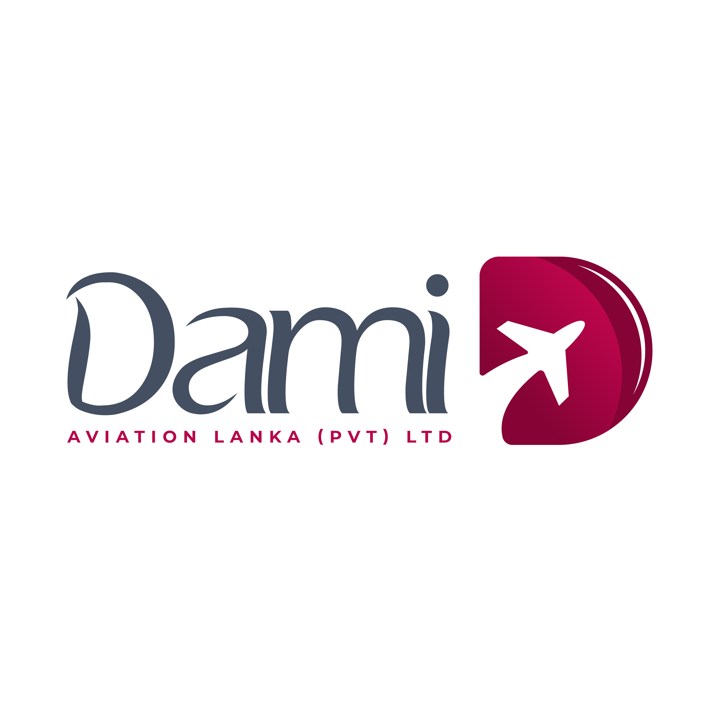

# DAMI Aviation Training Institute Website

<div align="center">
  
  
  <p><strong>A modern, responsive website for DAMI Aviation Training Institute built with React, TypeScript, and Tailwind CSS.</strong></p>
</div>

## 🚀 Features

### 🎓 **Training Programs**
<div align="center">
  
  <p><em>Comprehensive training program with detailed modules and pricing</em></p>
</div>

- Comprehensive cabin crew training course
- Detailed course modules and curriculum
- Entry requirements and qualifications
- Job opportunities and career prospects
- Pricing and enrollment information

### 🖼️ **Interactive Gallery**
<div align="center">
  
  <p><em>Interactive gallery with 11 specialized training categories</em></p>
</div>

- 11 specialized training categories
- High-quality images and videos
- Category-based filtering
- Lightbox modal for detailed viewing
- Professional training documentation

### 🛠️ **Additional Services**
<div align="center">
  
  <p><em>Professional services beyond main training programs</em></p>
</div>

- Airport Service Agent Exam Preparation (1500+ MCQs)
- Professional CV Creation Service
- Aviation Interview Preparation
- Career Consultation
- Document Verification & Guidance
- English Proficiency Test Preparation

### 🎨 **Modern Design**
<div align="center">
  
  <p><em>Fully responsive design optimized for all devices</em></p>
</div>

- Responsive design for all devices
- Professional aviation-themed UI
- Smooth animations and transitions
- Optimized performance
- SEO-friendly structure

## 🛠️ **Tech Stack**

<div align="center">
  
  
  
  
  
</div>

<br/>

- **Frontend:** React 18 with TypeScript
- **Styling:** Tailwind CSS
- **Routing:** React Router DOM
- **Icons:** Lucide React
- **Build Tool:** Vite
- **Deployment:** Ready for Vercel/Netlify

## 📦 **Installation**

1. **Clone the repository:**
   ```bash
   git clone https://github.com/yourusername/dami-aviation-website.git
   cd dami-aviation-website
   ```

2. **Install dependencies:**
   ```bash
   npm install
   ```

3. **Start the development server:**
   ```bash
   npm run dev
   ```

4. **Open your browser:**
   Navigate to `http://localhost:5173`

## 🚀 **Available Scripts**

- `npm run dev` - Start development server
- `npm run build` - Build for production
- `npm run preview` - Preview production build
- `npm run lint` - Run ESLint

## 📁 **Project Structure**

```
src/
├── components/          # Reusable UI components
│   ├── course/         # Course-specific components
│   └── ui/             # Generic UI components
├── data/               # Static data and configurations
├── pages/              # Page components
├── types/              # TypeScript type definitions
├── utils/              # Utility functions
└── styles/             # CSS and styling files
```

## 🎯 **Key Pages**

<div align="center">
  
  <p><em>Seamless navigation between all sections</em></p>
</div>

- **Home** (`/`) - Landing page with hero, about, and contact sections
- **Training** (`/course`) - Detailed course information and enrollment
- **Gallery** (`/gallery`) - Interactive photo and video gallery
- **Other Services** (`/other-services`) - Additional services and offerings

## 📱 **Contact Integration**

- WhatsApp integration for instant communication
- Contact forms with validation
- Service-specific inquiry handling

## 🔧 **Configuration**

### WhatsApp Integration
Update the phone number in `src/utils/whatsapp.ts`:
```typescript
const whatsappUrl = `https://wa.me/94773428832?text=${message}`;
```

### Course Data
Modify course information in `src/data/` directory:
- `courseModules.ts` - Training modules
- `entryRequirements.ts` - Admission requirements
- `jobOpportunities.ts` - Career prospects
- `otherServices.ts` - Additional services

## 🚀 **Deployment**

### Vercel (Recommended)
1. Push your code to GitHub
2. Connect your repository to Vercel
3. Deploy with zero configuration

### Netlify
1. Build the project: `npm run build`
2. Deploy the `dist` folder to Netlify

## 📄 **License**

This project is proprietary software owned by DAMI Aviation Training Institute. All rights reserved. See the [LICENSE](LICENSE) file for details.

**⚠️ IMPORTANT:** This software is not open source and may not be copied, modified, or distributed without explicit permission from DAMI Aviation Training Institute.

## 🤝 **Contributing**

1. Fork the repository
2. Create a feature branch (`git checkout -b feature/amazing-feature`)
3. Commit your changes (`git commit -m 'Add some amazing feature'`)
4. Push to the branch (`git push origin feature/amazing-feature`)
5. Open a Pull Request

## 📞 **Support**

<div align="center">
  
  <p><em>Multiple ways to get in touch with our team</em></p>
</div>

For support and inquiries:
- **WhatsApp:** [+94 77 342 8832](https://wa.me/94773428832)
- **Email:** info@damiaviation.com
- **Website:** [DAMI Aviation](https://damiaviation.lk)

## 🙏 **Acknowledgments**

- Built with modern web technologies
- Designed for aviation training excellence
- Optimized for user experience and performance

---

**DAMI Aviation Training Institute** - Elevating Aviation Careers Since 2025
